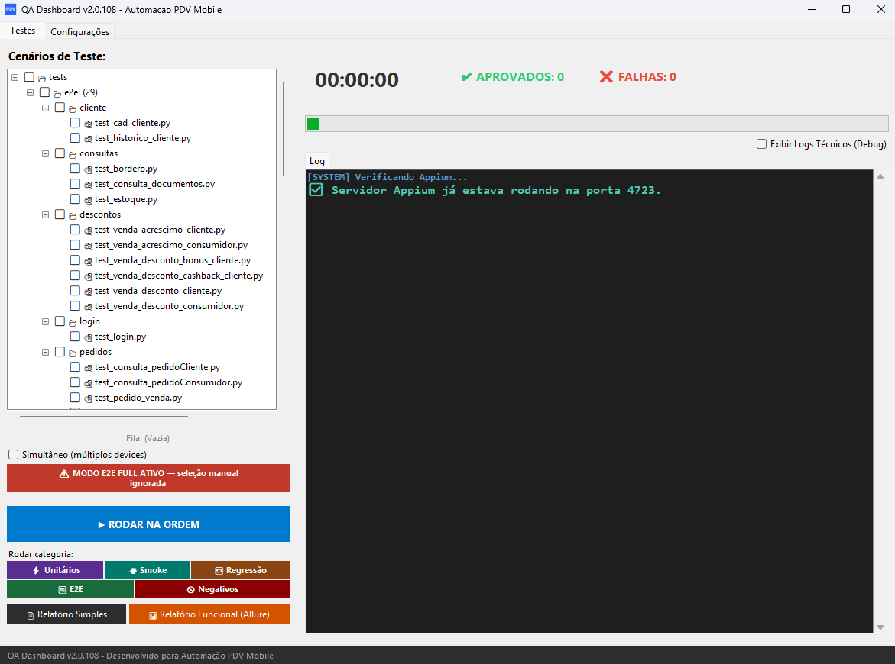
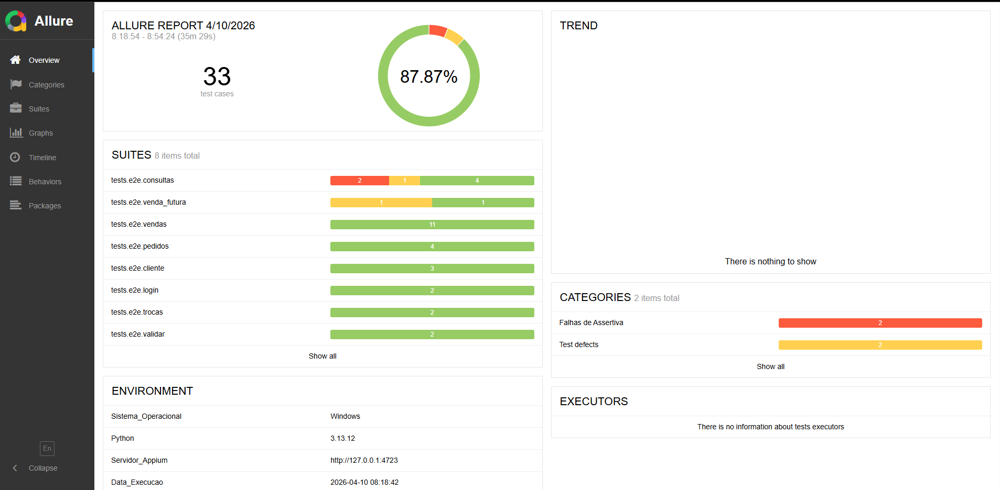
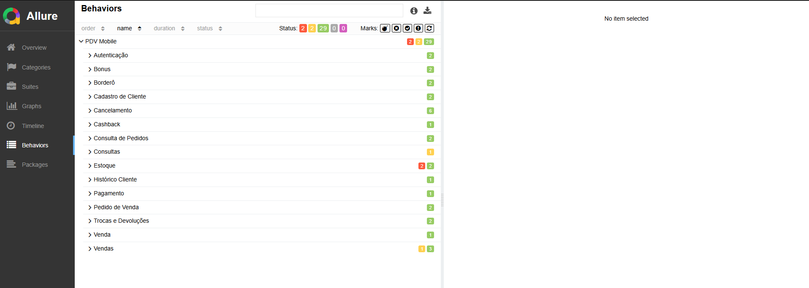

# 🚀 PDV Automação - Sistema Completo de Testes


Sistema completo de automação de testes mobile para PDV Android, incluindo framework de testes, dashboard interativo e sistema de compilação automatizado.

---

## Screenshots

### QA Dashboard v2.0.108



### Allure Report — Overview



### Allure Report — Behaviors



---

## 📋 Índice

- [Visão Geral](#visão-geral)
- [Estrutura do Projeto](#estrutura-do-projeto)
- [Quick Start](#quick-start)
- [Componentes Principais](#componentes-principais)
- [Fluxo de Trabalho](#fluxo-de-trabalho)
- [Documentação](#documentação)
- [Troubleshooting](#troubleshooting)

---

## 🎯 Visão Geral

Este projeto contém tudo necessário para automação de testes mobile do PDV:

### ✅ O que está incluído:

- **Framework de Testes** (`Testes_PDV/`)
  - 17 Page Objects (POM)
  - 323 testes automatizados (236 unitários + 18 smoke + 48 E2E + 5 negativos)
  - Integração com Allure Reports
  - Logs detalhados e coloridos

- **Dashboard Interativo** (`Gerador_EXE/runner/`)
  - Interface gráfica para executar testes
  - Gerenciamento de configurações
  - Visualização de logs em tempo real
  - Sistema de importação/exportação de settings

- **Sistema de Build** (`Gerador_EXE/build/`)
  - Compilação automatizada para EXE standalone
  - Geração de instalador (.exe)
  - Controle de versão automático
  - Pipeline de staging e produção

### 📊 Estatísticas Atuais

| Componente | Quantidade | Status |
|-----------|-----------|--------|
| **Testes Unitários** | 236 | ✅ 236/236 passando |
| **Smoke Tests** | 18 | ✅ Funcional |
| **Testes E2E** | 48 | ✅ Funcional |
| **Testes Negativos** | 5 | ✅ Funcional |
| **Page Objects** | 17 | ✅ 100% cobertos |
| **Tempo Total** | ~45 min | ✅ |

---

## 📁 Estrutura do Projeto

```
D:\PDV_AUTOMACAO/
│
├── 📂 Testes_PDV/                    ← 🎯 EDITE AQUI (desenvolvimento)
│   ├── 📂 pages/                     # 17 Page Objects
│   │   ├── base_page.py              # Classe base
│   │   ├── login_page.py
│   │   ├── home_page.py
│   │   ├── venda_page.py
│   │   ├── venda_sucesso_page.py
│   │   ├── pedido_page.py
│   │   ├── estoque_page.py
│   │   ├── troca_page.py
│   │   ├── bonus_page.py
│   │   ├── consulta_pedido_page.py
│   │   ├── venda_futura_page.py
│   │   └── documentos_page.py        # ⭐ NOVO
│   │
│   ├── 📂 tests/
│   │   ├── 📂 unit/                  # 236 testes unitários (14 arquivos)
│   │   │   ├── test_base_page_unit.py
│   │   │   ├── test_bonus_page_unit.py
│   │   │   ├── test_config_unit.py
│   │   │   ├── test_consulta_pedido_page_unit.py
│   │   │   ├── test_documentos_page_unit.py
│   │   │   ├── test_estoque_page_unit.py
│   │   │   ├── test_home_page_unit.py
│   │   │   ├── test_locators_unit.py
│   │   │   ├── test_login_page_unit.py
│   │   │   ├── test_pedido_page_unit.py
│   │   │   ├── test_troca_page_unit.py
│   │   │   ├── test_vale_presente_page_unit.py
│   │   │   ├── test_venda_futura_page_unit.py
│   │   │   └── test_venda_page_unit.py
│   │   │
│   │   ├── 📂 smoke/                 # 18 testes (11 individuais + test_smoke_e2e.py)
│   │   │   ├── test_01_app_abre.py
│   │   │   ├── test_02_login.py
│   │   │   ├── test_03_home_modulos.py
│   │   │   ├── test_04_venda_consumidor.py
│   │   │   ├── test_05_venda_cliente.py
│   │   │   ├── test_06_consultar_estoque.py
│   │   │   ├── test_07_cancelar_venda.py
│   │   │   ├── test_08_pedido.py
│   │   │   ├── test_09_troca.py
│   │   │   ├── test_10_bordero.py
│   │   │   ├── test_11_documentos.py
│   │   │   └── test_smoke_e2e.py     # consolidado (7 testes)
│   │   │
│   │   └── 📂 e2e/                   # 54 testes E2E
│   │       ├── test_login.py
│   │       ├── test_venda_consumidor.py
│   │       ├── test_venda_cliente.py
│   │       ├── test_pedido_vendaConsumidor.py
│   │       ├── test_pedido_vendaCliente.py
│   │       ├── test_estoque.py
│   │       ├── test_troca_consumidor.py
│   │       ├── test_troca_cliente.py
│   │       ├── test_bonus.py
│   │       ├── test_consulta_pedidoConsumidor.py
│   │       ├── test_consulta_pedidoCliente.py
│   │       ├── test_consulta_documentos.py  # ⭐ NOVO no smoke
│   │       ├── test_venda_futura.py
│   │       ├── test_venda_futura_domicilio.py
│   │       └── test_cancelamento.py
│   │
│   ├── config.py                     # Configurações globais
│   ├── conftest.py                   # Fixtures pytest
│   ├── test_data.py                  # Dados de teste
│   ├── framework.py                  # Framework Appium
│   ├── pytest.ini                    # Config pytest
│   ├── requirements.txt              # Dependências
│   ├── VERSION                       # Controle de versão
│   └── 📂 docs/                      # Documentação detalhada
│
├── 📂 Gerador_EXE/
│   ├── 📂 runner/
│   │   └── app_runner.py             # Dashboard (1530 linhas)
│   │
│   ├── 📂 output/
│   │   ├── 📂 staging/               # ⚙️ Sincronização automática
│   │   │   ├── config.py
│   │   │   ├── pages/
│   │   │   └── tests/
│   │   │
│   │   └── 📂 dist/                  # 📦 EXE compilado
│   │       └── QA_Dashboard.exe
│   │
│   └── 📂 build/
│       └── builder_pro.py            # Pipeline de build
│
├── 📂 logs/                          # Logs de execução
│   └── 📂 allure-results/            # Relatórios Allure
│
├── 📂 claude/                        # Agentes e Skills Claude
│   └── 📂 qa/                        # QA Skills
│       ├── 📂 agents/
│       ├── 📂 skills/
│       └── 📂 commands/
│
├── 🔧 ABRIR_DASHBOARD.bat            # ⭐ Execute para TESTAR
├── 🔨 COMPILAR.bat                   # Execute para COMPILAR
│
├── 📄 README.md                      # ⬅️ VOCÊ ESTÁ AQUI
├── 📄 CLAUDE.md                      # Instruções completas do projeto
└── 📂 detalhes/                      # Documentação técnica
    ├── README_DESENVOLVIMENTO.md
    ├── ARQUITETURA_COMPLETA.md
    ├── CONFIGURACAO_IMPRESSAO.md
    ├── MAPEAMENTO_IMPRESSOES.md
    └── MUDANCAS.md
```

---

## 🚀 Quick Start

### Pré-requisitos

- **Python 3.8+** instalado
- **Java JDK 11+** (para Appium)
- **Node.js 16+** (para Appium)
- **Android SDK** configurado
- **Appium 2.0+** instalado

### Instalação

```bash
# 1. Clone/baixe o projeto
cd D:\PDV_AUTOMACAO

# 2. Instale dependências
cd Testes_PDV
pip install -r requirements.txt

# 3. Instale Appium (se não tiver)
npm install -g appium
appium driver install uiautomator2

# 4. Configure test_data.py com seus dados
# Edite: IP do servidor, credenciais, etc.
```

### Primeira Execução

#### 🎯 Opção 1: Dashboard (Recomendado)

```bash
# Execute o dashboard em modo desenvolvimento
ABRIR_DASHBOARD.bat

# O que acontece:
# 1. Sincroniza automaticamente arquivos de Testes_PDV/ para staging/
# 2. Abre interface gráfica
# 3. Configure e execute testes com cliques
```

#### 🎯 Opção 2: Linha de Comando

```bash
cd Testes_PDV

# Executar testes unitários (rápido - <10s)
pytest tests/unit/ -v

# Executar smoke tests (3-5 min)
pytest tests/smoke/ -v -m smoke

# Executar testes E2E (30-45 min)
pytest tests/e2e/ -v

# Gerar relatório Allure
pytest -v --alluredir=logs/allure-results
allure serve logs/allure-results
```

---

## 🔧 Componentes Principais

### 1️⃣ Framework de Testes (`Testes_PDV/`)

**Propósito**: Código fonte dos testes automatizados

**Principais arquivos**:
- `pages/*.py` - Page Objects (POM)
- `tests/unit/*.py` - Testes unitários (sem Appium)
- `tests/smoke/*.py` - Smoke tests (validação rápida)
- `tests/e2e/*.py` - Testes completos E2E
- `config.py` - Configurações globais
- `conftest.py` - Fixtures e setup do pytest

**Como usar**:
```bash
# Edite os arquivos aqui
# Execute testes com pytest ou pelo dashboard
```

### 2️⃣ Dashboard (`Gerador_EXE/runner/app_runner.py`)

**Propósito**: Interface gráfica para executar testes

**Recursos**:
- ✅ Execução de testes com cliques
- ✅ Configuração de ambiente (servidor, credenciais, APK)
- ✅ Logs em tempo real
- ✅ Importação/Exportação de settings
- ✅ Sistema de impressões configurável
- ✅ Modo debug otimizado

**Como usar**:
```bash
# Modo desenvolvimento (com auto-sync)
ABRIR_DASHBOARD.bat

# Modo produção (EXE compilado)
Gerador_EXE\output\dist\QA_Dashboard.exe
```

### 3️⃣ Sistema de Build (`Gerador_EXE/build/`)

**Propósito**: Compilar projeto em executável standalone

**O que faz**:
1. Sincroniza arquivos de `Testes_PDV/` para `staging/`
2. Compila com PyInstaller
3. Gera executável único `QA_Dashboard.exe`
4. Cria instalador (opcional)
5. Incrementa versão automaticamente

**Como usar**:
```bash
# Compilar manualmente
cd Gerador_EXE\build
python builder_pro.py

# Ou usar o atalho
COMPILAR.bat
```

---

## 🔄 Fluxo de Trabalho

### Workflow de Desenvolvimento

```
┌─────────────────────────────────────────────┐
│  1. EDITAR código em Testes_PDV/            │
│     - Adicionar novos testes                │
│     - Modificar Page Objects                │
│     - Atualizar configurações               │
└─────────────────┬───────────────────────────┘
                  │
                  ↓
┌─────────────────────────────────────────────┐
│  2. TESTAR com ABRIR_DASHBOARD.bat          │
│     - Sincroniza automaticamente            │
│     - Simula ambiente do EXE                │
│     - Valida mudanças                       │
└─────────────────┬───────────────────────────┘
                  │
                  ↓
┌─────────────────────────────────────────────┐
│  3. AJUSTAR se necessário                   │
│     - Corrigir bugs                         │
│     - Melhorar testes                       │
│     - Voltar para passo 1                   │
└─────────────────┬───────────────────────────┘
                  │
                  ↓
┌─────────────────────────────────────────────┐
│  4. COMPILAR quando OK                      │
│     - Executar COMPILAR.bat                 │
│     - Testar EXE gerado                     │
│     - Distribuir                            │
└─────────────────────────────────────────────┘
```

### Workflow de Execução de Testes

```
┌─────────────────────────────────────────────┐
│  ABRIR DASHBOARD                            │
│  (ABRIR_DASHBOARD.bat ou EXE)               │
└─────────────────┬───────────────────────────┘
                  │
                  ↓
┌─────────────────────────────────────────────┐
│  CONFIGURAR AMBIENTE                        │
│  - Servidor (IP, Porta)                     │
│  - Credenciais (Empresa, Usuário, Senha)    │
│  - APK path (se necessário)                 │
│  - Impressões (Cupom, NFC-E, DANFE)         │
└─────────────────┬───────────────────────────┘
                  │
                  ↓
┌─────────────────────────────────────────────┐
│  SELECIONAR TESTES                          │
│  - Tipo: Unitários / Smoke / E2E            │
│  - Suite: Venda, Pedido, Estoque, etc       │
└─────────────────┬───────────────────────────┘
                  │
                  ↓
┌─────────────────────────────────────────────┐
│  EXECUTAR                                   │
│  - Inicia Appium automaticamente            │
│  - Conecta ao dispositivo                   │
│  - Roda testes                              │
│  - Mostra logs em tempo real                │
└─────────────────┬───────────────────────────┘
                  │
                  ↓
┌─────────────────────────────────────────────┐
│  VISUALIZAR RESULTADOS                      │
│  - Logs no Dashboard                        │
│  - Relatório Allure (opcional)              │
│  - Exportar settings (opcional)             │
└─────────────────────────────────────────────┘
```

---

## 📚 Documentação

### Documentação Principal

| Documento | Descrição |
|-----------|-----------|
| **[README.md](README.md)** | ⬅️ Este arquivo - Visão geral completa |
| **[detalhes/README_DESENVOLVIMENTO.md](detalhes/README_DESENVOLVIMENTO.md)** | Guia de desenvolvimento e workflow |
| **[detalhes/ARQUITETURA_COMPLETA.md](detalhes/ARQUITETURA_COMPLETA.md)** | Arquitetura técnica detalhada |
| **[detalhes/CONFIGURACAO_IMPRESSAO.md](detalhes/CONFIGURACAO_IMPRESSAO.md)** | Sistema de impressões configurável |
| **[detalhes/MAPEAMENTO_IMPRESSOES.md](detalhes/MAPEAMENTO_IMPRESSOES.md)** | Mapeamento de fluxo de impressões |

### Documentação dos Testes

| Documento | Descrição |
|-----------|-----------|
| **[Testes_PDV/README.md](Testes_PDV/README.md)** | Overview completo do framework |
| **[docs/GETTING_STARTED.md](Testes_PDV/docs/GETTING_STARTED.md)** | Guia de início rápido |
| **[docs/TESTS.md](Testes_PDV/docs/TESTS.md)** | Estratégia de testes |
| **[docs/UNIT_TESTS.md](Testes_PDV/docs/UNIT_TESTS.md)** | Testes unitários |
| **[docs/SMOKE_TESTS.md](Testes_PDV/docs/SMOKE_TESTS.md)** | Smoke tests |
| **[docs/PAGE_OBJECTS.md](Testes_PDV/docs/PAGE_OBJECTS.md)** | Page Objects |

---

## 🎯 Casos de Uso Comuns

### Caso 1: Adicionar Novo Teste E2E

```bash
# 1. Criar arquivo de teste
cd Testes_PDV/tests/e2e
# Criar test_nova_funcionalidade.py

# 2. Testar
cd ..\..\..
ABRIR_DASHBOARD.bat
# Executar "Nova Funcionalidade" no dashboard

# 3. Se OK, compilar
COMPILAR.bat
```

### Caso 2: Adicionar Novo Page Object

```bash
# 1. Criar Page Object
cd Testes_PDV/pages
# Criar nova_page.py

# 2. Criar testes unitários
cd ..\tests\unit
# Criar test_nova_page_unit.py

# 3. Testar
pytest tests/unit/test_nova_page_unit.py -v

# 4. Validar no dashboard
ABRIR_DASHBOARD.bat
```

### Caso 3: Testar em Múltiplos Ambientes

```bash
# 1. Configurar Homologação
ABRIR_DASHBOARD.bat
# Preencher dados de homologação
# Exportar Settings → salvar como settings_homolog.json

# 2. Configurar Produção
# Preencher dados de produção
# Exportar Settings → salvar como settings_prod.json

# 3. Alternar entre ambientes
# Importar Settings → selecionar o desejado
# Executar testes
```

### Caso 4: Debug de Teste Falhando

```bash
# 1. Ativar modo debug no Dashboard
# Marcar checkbox "Mostrar logs técnicos (debug)"

# 2. Executar teste que falha

# 3. Analisar saída
# - Ações aparecem limpas
# - Detalhes técnicos só em erros
# - Stack trace completo disponível

# 4. Corrigir código
# Editar em Testes_PDV/

# 5. Re-testar
# ABRIR_DASHBOARD.bat (auto-sincroniza)
```

---

## 🆕 Mudanças Recentes (v2.0.108)

### ✅ Corrigido em 2026-04-10

1. **23 arquivos de testes duplicados removidos** — `tests/e2e/test_*.py` raiz eram cópias das subpastas; subpastas têm versões mais atualizadas
2. **Hook `pytest_runtest_makereport` duplicado** — definido duas vezes no `conftest.py`; segunda definição sobrescrevia a primeira. Unificado com `tryfirst=True`
3. **pytest.ini com opções inválidas** — `log_selenium.webdriver`, `log_urllib3`, `log_appium` não são opções válidas do pytest; movidas para `conftest.py` como `logging.getLogger().setLevel()`
4. **`test_obter_quantidade_estoque`** — teste unitário esperava retorno e comportamento de versão antiga do método; atualizado para implementação atual
5. **`test_executar_fluxo_completo_vale_presente`** — `VendaSucessoPage` instanciada dentro do método não era mockada; `BasePage.__init__` patchado zerava `self.driver`; adicionado `@patch('pages.venda_sucesso_page.VendaSucessoPage')`

### 📊 Estado Atual (2026-04-10)

| Tipo | Arquivos | Testes | Status |
|---|---|---|---|
| **Unitários** | 14 | **236** | 236/236 passando |
| **Smoke** | 12 | **18** | Funcional |
| **E2E** | 29 | **48** | Funcional |
| **Negativos** | 3 | **5** | Funcional |
| **TOTAL** | 58 | **323** | 0 warnings na coleta |

---

## 🐛 Troubleshooting

### Dashboard não abre

**Problema**: Executar `ABRIR_DASHBOARD.bat` não abre nada

**Solução**:
```bash
# Verificar Python
python --version

# Verificar dependências
cd Testes_PDV
pip install -r requirements.txt

# Testar manualmente
cd ..\Gerador_EXE\output\staging
python ..\..\..\runner\app_runner.py --dev
```

### Arquivos não sincronizam

**Problema**: Mudanças em `Testes_PDV/` não aparecem no Dashboard

**Solução**:
```bash
# Fechar Dashboard
# Re-executar
ABRIR_DASHBOARD.bat

# Ou sincronizar manualmente
robocopy "Testes_PDV" "Gerador_EXE\output\staging" /MIR /XD __pycache__ .pytest_cache logs .git
```

### Appium não encontrado

**Problema**: Dashboard não encontra Appium

**Solução**:
```bash
# Instalar Appium
npm install -g appium
appium driver install uiautomator2

# Verificar instalação
appium --version
npm bin -g

# Configurar manualmente no Dashboard
# Aba "Configurações" → Campo "Appium Path"
```

### Testes falhando após atualização

**Problema**: Testes que passavam agora falham

**Solução**:
```bash
# 1. Executar testes unitários
pytest tests/unit/ -v

# 2. Se falharem, verificar locators
pytest tests/unit/test_locators_unit.py -v

# 3. Atualizar lista de IDS_VALIDOS_DO_APP
# Conectar dispositivo e extrair IDs:
adb shell uiautomator dump /sdcard/ui.xml
adb pull /sdcard/ui.xml
# Adicionar novos IDs em test_locators_unit.py

# 4. Re-testar
pytest tests/unit/ -v
```

### Settings não importa

**Problema**: Importar settings não preenche campos

**Solução**:
```bash
# Verificar formato JSON
cat settings.json

# Exemplo correto:
{
  "server_ip": "192.168.1.100",
  "server_port": "3000",
  "company": "382",
  "user": "vendedor",
  "password": "senha123",
  ...
}

# Se inválido, editar manualmente ou exportar novamente
```

### Performance ruim / Travamentos

**Problema**: Dashboard trava durante execução

**Solução**:
```bash
# 1. Desmarcar "Mostrar logs técnicos (debug)"
# 2. Aumentar RAM disponível no dispositivo
# 3. Limpar logs antigos
rd /s /q logs\allure-results
mkdir logs\allure-results

# 4. Fechar aplicações desnecessárias
# 5. Executar smoke ao invés de E2E completo
pytest tests/smoke/ -v -m smoke
```

---

## 🔗 Links Úteis

- [Appium Documentation](https://appium.io/docs/en/2.0/)
- [Pytest Documentation](https://docs.pytest.org/)
- [Allure Reports](https://docs.qameta.io/allure/)
- [Page Object Pattern](https://www.selenium.dev/documentation/test_practices/encouraged/page_object_models/)
- [Python Unittest Mock](https://docs.python.org/3/library/unittest.mock.html)

---

## 📞 Suporte

**Problemas com testes**: Verificar documentação em `Testes_PDV/docs/`

**Problemas com Dashboard**: Verificar [`detalhes/README_DESENVOLVIMENTO.md`](detalhes/README_DESENVOLVIMENTO.md)

**Problemas com Build**: Verificar [`detalhes/ARQUITETURA_COMPLETA.md`](detalhes/ARQUITETURA_COMPLETA.md)

**Configuração de impressões**: Verificar [`detalhes/CONFIGURACAO_IMPRESSAO.md`](detalhes/CONFIGURACAO_IMPRESSAO.md)

---

## 📌 Informações da Versão

**Versão Atual**: 2.0.108

**Data da Última Atualização**: 10/04/2026

**Estado**: 323 testes | 236/236 unitários passando | 0 warnings

**Próximas Melhorias Planejadas**:
- [ ] Integração com CI/CD (GitLab)
- [ ] Testes de performance
- [ ] Cobertura de código automatizada
- [ ] Dashboard web (opcional)

---

## 📄 Licença

Projeto interno - Todos os direitos reservados

---

**Desenvolvido com ❤️ pela Equipe QA Mobile**

**Última atualização**: 10/04/2026 | **Versão**: 2.0.108
